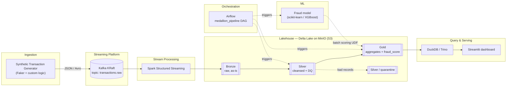
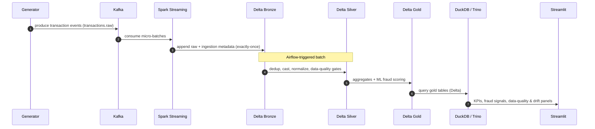

# TransactPulse

> **Real-Time Big Data Lakehouse for financial transactions.**
> Synthetic transactions flow through Kafka, are processed by Spark Structured
> Streaming, land in a Delta Lake medallion architecture on MinIO, and are served
> to analysts via DuckDB/Trino and a Streamlit dashboard — with Airflow
> orchestrating the batch layers and a fraud-scoring ML model in the loop.


---

## Table of contents

- [What is this?](#what-is-this)
- [Architecture](#architecture)
- [Data flow](#data-flow)
- [Tech stack](#tech-stack)
- [Medallion architecture](#medallion-architecture-bronze--silver--gold)
- [Repository layout](#repository-layout)
- [How to run](#how-to-run)
- [Roadmap](#roadmap)
- [Architecture Decision Records](#architecture-decision-records)
- [What this project demonstrates](#what-this-project-demonstrates)
- [License](#license)

---

## What is this?

**TransactPulse** is a portfolio-grade Big Data project that simulates an
end-to-end, real-time **lakehouse** for payment transactions. It is built to
demonstrate the full modern data-engineering toolchain working together on a
single machine via `docker compose`:

- a **synthetic transaction generator** producing realistic payment events
  (log-normal amounts, hourly seasonality, ~0.3 % fraud, late-arriving events);
- **streaming ingestion** from Kafka into a Delta Lake **bronze** layer;
- **data-quality gated** cleansing into a **silver** layer (dedup, currency
  normalization, ISO standardization, quarantine for bad records);
- **analytical aggregates** and **ML fraud scoring** in a **gold** layer;
- **orchestration** of the batch path with Airflow;
- **interactive analytics** through DuckDB/Trino and a Streamlit dashboard.

> ⚠️ **No production data.** Every record is synthetic — generated locally. There
> is zero real banking data anywhere in this project.

---

## Architecture



## Data flow



---

## Tech stack

| Layer            | Technology                                   | Role                                            |
| ---------------- | -------------------------------------------- | ----------------------------------------------- |
| Ingestion        | Python, Faker, confluent-kafka               | Synthetic transaction generation + producer     |
| Streaming bus    | **Apache Kafka** (KRaft, no ZooKeeper)       | Durable event backbone (`transactions.raw`)     |
| Stream processing| **PySpark Structured Streaming**             | Kafka → Delta bronze, exactly-once              |
| Storage format   | **Delta Lake**                               | ACID tables, time travel, schema evolution      |
| Object store     | **MinIO** (S3-compatible)                    | Local lakehouse storage (`s3a://lakehouse`)     |
| Data quality     | **Great Expectations**                       | Expectation suites + quarantine                 |
| ML               | scikit-learn / XGBoost                       | Batch fraud scoring as Spark UDF                |
| Orchestration    | **Apache Airflow**                           | `medallion_pipeline` DAG                         |
| Query engine     | **DuckDB / Trino**                           | Analytical SQL over gold tables                 |
| Dashboard        | **Streamlit**                                | KPIs, fraud signals, DQ & drift                 |
| Runtime          | **Docker Compose**                           | One-command stack                               |

> Stack rationale lives in [ADR 0002](docs/adr/0002-wybor-stacku.md).

---

## Medallion architecture (bronze → silver → gold)

The lakehouse follows the **medallion** pattern — data is progressively refined
across three quality tiers, each materialized as Delta tables on MinIO.

| Tier       | Path                                  | Contents                                                                                  |
| ---------- | ------------------------------------- | ----------------------------------------------------------------------------------------- |
| 🥉 **Bronze** | `s3a://lakehouse/bronze/transactions` | Raw events **as-is** from Kafka + ingestion metadata (`ingestion_time`, `source_topic`, `_offset`). No business transformations. |
| 🥈 **Silver** | `s3a://lakehouse/silver/transactions` | Cleansed & conformed: deduped by `transaction_id`, typed, currencies normalized to PLN, ISO country codes, watermarked. Bad records routed to `silver/quarantine`. |
| 🥇 **Gold**   | `s3a://lakehouse/gold/*`              | Business-ready: aggregates (`daily_volume_by_country`, `merchant_category_kpi`, `account_velocity`), `fraud_signals`, and `scored_transactions` with `fraud_score`. |

> Why a lakehouse + medallion instead of a classic data warehouse?
> See [ADR 0001](docs/adr/0001-architektura-medalionowa.md).

---

## Repository layout

```
TransactPulse/
├── ingestion/        # Synthetic transaction generator + Kafka producer
├── streaming/        # PySpark Structured Streaming jobs (bronze)
├── lakehouse/        # Silver/gold transforms, data quality, ML scoring
├── orchestration/    # Airflow DAGs and config
├── analytics/        # SQL queries (DuckDB/Trino)
├── dashboard/        # Streamlit app
├── infra/            # docker-compose, topic creation, infra scripts
├── tests/            # Unit + integration tests
├── docs/
│   └── adr/          # Architecture Decision Records (MADR)
├── LICENSE
└── README.md
```

---

## How to run

> The full `docker compose up` experience is assembled incrementally across the
> roadmap below and finalized in Stage 8. Until then, each stage's README section
> documents how to run that slice.

```bash
# Clone
git clone https://github.com/pawel123j/transactpulse.git
cd transactpulse

# (Stage 3+) bring up the base infrastructure (Kafka + MinIO)
docker compose -f infra/docker-compose.yml up -d

# (Stage 8) bring up the full stack — single command
docker compose up
```

### Verify the infrastructure (Stage 3)

- **Kafka UI** → http://localhost:8080 — topic `transactions.raw` (3 partitions).
- **MinIO console** → http://localhost:9001 (`minioadmin` / `minioadmin123`) —
  bucket `lakehouse`.
- **End-to-end smoke test** (generator → Kafka → CLI consumer):

  ```bash
  pip install -r ingestion/requirements.txt
  ./infra/smoke-test.sh 20
  ```

See [`infra/README.md`](infra/README.md) for details, the networking model, and
teardown.

---

## Roadmap

The project is built in eight checkpointed stages:

- [x] **Stage 1 — Repository foundation & architecture** — structure, README, initial ADRs.
- [x] **Stage 2 — Synthetic transaction generator** — realistic producer → Kafka ([ingestion/](ingestion/README.md)).
- [x] **Stage 3 — Infrastructure** — Kafka (KRaft) + MinIO in Docker ([infra/](infra/README.md)).
- [x] **Stage 4 — Bronze layer** — Spark Structured Streaming → Delta on MinIO ([streaming/](streaming/README.md)).
- [x] **Stage 5 — Silver layer** — cleansing, dedup, data-quality gates, quarantine ([lakehouse/](lakehouse/README.md)).
- [x] **Stage 6 — Gold layer & ML** — aggregates + fraud scoring + drift metrics ([lakehouse/](lakehouse/README.md)).
- [x] **Stage 7 — Orchestration & query** — Airflow DAG ([orchestration/](orchestration/README.md)) + DuckDB ([analytics/](analytics/README.md)).
- [ ] **Stage 8 — Dashboard, tests, CI** — Streamlit, full compose, GitHub Actions, `v1.0.0`.

---

## Architecture Decision Records

Significant technical decisions are captured as [ADRs](docs/adr/) in the
[MADR](https://adr.github.io/madr/) format:

| ADR | Title |
| --- | ----- |
| [0000](docs/adr/0000-template.md) | ADR template (MADR) |
| [0001](docs/adr/0001-architektura-medalionowa.md) | Medallion lakehouse architecture |
| [0002](docs/adr/0002-wybor-stacku.md) | Technology stack selection |
| [0003](docs/adr/0003-format-serializacji.md) | Wire serialization format (JSON now, Avro-ready) |
| [0004](docs/adr/0004-strategia-checkpoint-i-exactly-once.md) | Checkpointing & exactly-once for bronze ingest |
| [0005](docs/adr/0005-data-quality-i-kwarantanna.md) | Data quality gates & quarantine for silver |
| [0006](docs/adr/0006-batch-scoring-ml-jako-udf.md) | Batch ML fraud scoring as a Spark UDF |
| [0007](docs/adr/0007-airflow-vs-prefect.md) | Orchestration with Apache Airflow |
| [0008](docs/adr/0008-duckdb-vs-trino.md) | DuckDB query engine for gold analytics |

---

## What this project demonstrates

For recruiters and reviewers, TransactPulse is designed to prove hands-on command
of: **real-time streaming** (Kafka + Spark Structured Streaming), **lakehouse &
medallion** modeling (Delta Lake), **data quality** engineering (Great
Expectations + quarantine), **orchestration** (Airflow), **ML integration**
(batch scoring + drift), and **idempotent, containerized, reproducible**
infrastructure (`docker compose up`).

---

## License

[MIT](LICENSE) © 2026 Paweł Jankowicz
