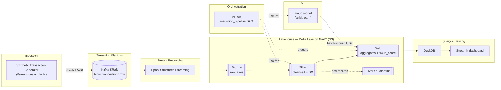
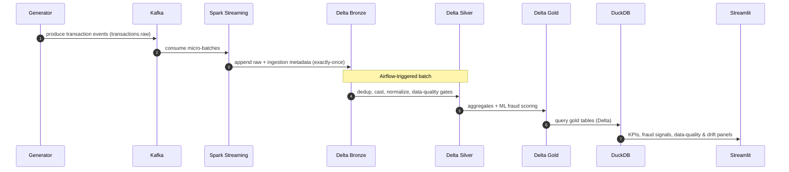

# TransactPulse

> **Real-Time Big Data Lakehouse for financial transactions.**
> Synthetic transactions flow through Kafka, are processed by Spark Structured
> Streaming, land in a Delta Lake medallion architecture on MinIO, and are served
> to analysts via DuckDB and a Streamlit dashboard — with Airflow orchestrating
> the batch layers and a fraud-scoring ML model in the loop.


[](https://github.com/Pawel123j/TransactPulse/actions/workflows/ci.yml)

---

## Case study

[`docs/CASE_STUDY.md`](docs/CASE_STUDY.md) — the engineering decisions behind
this system, written to be discussed rather than skimmed: why Delta over plain
Parquet, why the data-quality gate blocks instead of warning, why the drift
policy treats a missing reference as a monitoring gap rather than a healthy
signal, and the bugs that survived a green test suite.

## Table of contents

- [What is this?](#what-is-this)
- [Key features](#key-features)
- [Screenshots](#screenshots)
- [Architecture](#architecture)
- [Data flow](#data-flow)
- [Tech stack](#tech-stack)
- [Medallion architecture](#medallion-architecture-bronze--silver--gold)
- [Fraud-detection model](#fraud-detection-model)
- [Repository layout](#repository-layout)
- [Quickstart](#quickstart)
- [End-to-end verification](#end-to-end-verification-requires-a-local-docker-daemon)
- [Tests & quality gates](#tests--quality-gates)
- [Production & security considerations](#production--security-considerations)
- [Roadmap](#roadmap)
- [Architecture Decision Records](#architecture-decision-records)
- [What this project demonstrates](#what-this-project-demonstrates)
- [License](#license)

---

## What is this?

**TransactPulse** is a portfolio-grade Big Data project that simulates an
end-to-end, real-time **lakehouse** for payment transactions. It is built to
demonstrate the full modern data-engineering toolchain working together on a
single machine via `docker compose`:

- a **synthetic transaction generator** producing realistic payment events
  (log-normal amounts, hourly seasonality, ~0.3 % fraud, late-arriving events);
- **streaming ingestion** from Kafka into a Delta Lake **bronze** layer;
- **data-quality gated** cleansing into a **silver** layer (dedup, currency
  normalization, ISO standardization, quarantine for bad records);
- **analytical aggregates** and **ML fraud scoring** in a **gold** layer;
- **orchestration** of the batch path with Airflow;
- **interactive analytics** through DuckDB and a Streamlit dashboard.

> ⚠️ **No production data.** Every record is synthetic — generated locally. There
> is zero real banking data anywhere in this project.

**The problem it models.** Payment processors see a continuous stream of
transactions in which a tiny fraction is fraudulent. The data arrives messy
(duplicates, late events, mixed currencies, malformed payloads), and analysts
need trustworthy aggregates fast. TransactPulse ingests that stream, cleans and
validates it, scores every transaction for fraud risk, and serves the result —
with data-quality and model-drift reporting along the way.

---

## Key features

| Capability | Where |
| ---------- | ----- |
| Streaming ingestion (Kafka → Spark Structured Streaming → Delta) | [`streaming/`](streaming/README.md) |
| Medallion architecture (bronze → silver → gold) | [`streaming/`](streaming/), [`lakehouse/`](lakehouse/) |
| Schema & data validation, deduplication, currency normalization | [`lakehouse/transforms.py`](lakehouse/transforms.py) |
| Data-quality gate + quarantine table for rejected records | [`lakehouse/dq_rules.py`](lakehouse/dq_rules.py), [`quality_gate.py`](lakehouse/quality_gate.py) |
| Fraud scoring as a vectorized Spark `pandas_udf` (+ heuristic fallback) | [`lakehouse/ml/`](lakehouse/ml/) |
| Model drift detection (PSI / KS) | [`lakehouse/drift.py`](lakehouse/drift.py) |
| Orchestration of the batch path | [`orchestration/dags/`](orchestration/dags/) |
| Interactive dashboard over the gold layer | [`dashboard/`](dashboard/README.md) |
| Automated tests (121, incl. Spark) + CI/CD + security scanning | [`tests/`](tests/), [`.github/workflows/ci.yml`](.github/workflows/ci.yml) |

---

## Screenshots

Every interface in this project is served by a container, so the screenshots are
captured from a live local run rather than committed as mock-ups. The capture
procedure — which services to start and what each image must show — is in
[`docs/screenshots/README.md`](docs/screenshots/README.md), and the run itself is
step 1 of [`HUMAN_ACTION_REQUIRED.md`](HUMAN_ACTION_REQUIRED.md).

<!-- Uncomment once the files in docs/screenshots/ have been captured.
| Streamlit dashboard | Airflow DAG |
| ------------------- | ----------- |
|  |  |
|  |  |
-->

---

## Architecture



## Data flow



---

## Tech stack

| Layer             | Technology                              | Role                                                      |
| ----------------- | --------------------------------------- | --------------------------------------------------------- |
| Ingestion         | Python 3.11, Faker, confluent-kafka     | Synthetic transaction generation + producer                |
| Streaming bus     | **Apache Kafka** (KRaft, no ZooKeeper)  | Durable event backbone (`transactions.raw`)                |
| Stream processing | **PySpark Structured Streaming**        | Kafka → Delta bronze, exactly-once                         |
| Storage format    | **Delta Lake**                          | ACID tables, time travel, schema evolution                 |
| Object store      | **MinIO** (S3-compatible)               | Local lakehouse storage (`s3a://lakehouse`)                |
| Data quality      | Native Spark rules + **Great Expectations** | Blocking gate + quarantine; GE suite for the report (optional dependency) |
| ML                | **scikit-learn**                        | Batch fraud scoring as a Spark `pandas_udf`, PSI/KS drift  |
| Orchestration     | **Apache Airflow**                      | `medallion_pipeline` + `train_fraud_model` DAGs            |
| Query engine      | **DuckDB**                              | Analytical SQL over the gold Delta tables                  |
| Dashboard         | **Streamlit**                           | KPIs, fraud signals, DQ & drift                            |
| Runtime           | **Docker Compose**                      | One-command stack                                          |
| Quality gates     | **pytest**, **ruff**, bandit, gitleaks  | Tests, lint/format, SAST & secret scanning                 |
| CI/CD             | **GitHub Actions**                      | Lint, unit tests, Spark tests, security checks, image builds |

> Stack rationale lives in [ADR 0002](docs/adr/0002-wybor-stacku.md).
> **Trino is *not* part of v1.0.0** — DuckDB was chosen deliberately for a
> single-node lakehouse ([ADR 0008](docs/adr/0008-duckdb-vs-trino.md)); a Trino
> serving layer is a [v2.0 roadmap](#roadmap) item.
> Great Expectations is an **optional** dependency: it enriches the silver
> data-quality report, and the report falls back to native Spark metrics when GE
> is absent. The blocking gate itself is native Spark and always runs.

---

## Medallion architecture (bronze → silver → gold)

The lakehouse follows the **medallion** pattern — data is progressively refined
across three quality tiers, each materialized as Delta tables on MinIO.

| Tier       | Path                                  | Contents                                                                                  |
| ---------- | ------------------------------------- | ----------------------------------------------------------------------------------------- |
| 🥉 **Bronze** | `s3a://lakehouse/bronze/transactions` | Raw events **as-is** from Kafka + ingestion metadata (`ingestion_time`, `source_topic`, `_offset`). No business transformations. |
| 🥈 **Silver** | `s3a://lakehouse/silver/transactions` | Cleansed & conformed: deduped by `transaction_id`, typed, currencies normalized to PLN, ISO country codes, watermarked. Bad records routed to `silver/quarantine`. |
| 🥇 **Gold**   | `s3a://lakehouse/gold/*`              | Business-ready: aggregates (`daily_volume_by_country`, `merchant_category_kpi`, `account_velocity`), `fraud_signals`, and `scored_transactions` with `fraud_score`. |

> Why a lakehouse + medallion instead of a classic data warehouse?
> See [ADR 0001](docs/adr/0001-architektura-medalionowa.md).

---

## Fraud-detection model

Scoring is a **swappable seam** ([ADR 0006](docs/adr/0006-batch-scoring-ml-jako-udf.md)):
the gold job loads `models/fraud_model.pkl` and applies it to silver data as a
vectorized Spark `pandas_udf`.

**The pipeline runs without a trained artifact.** The `.pkl` is *not* committed
(it is git-ignored — artifacts do not belong in source control). When the file is
missing, `load_or_default()` falls back to `HeuristicFraudModel` — a
deterministic, dependency-free logistic scorer over the same engineered features.
Gold therefore always produces a `fraud_score`, and the stack is usable on a
fresh clone; the scores are just weaker than a trained model's.

Train the real model (a scikit-learn `GradientBoostingClassifier`) either way:

```bash
# A) inside the stack — the Airflow DAG writes to the shared tp-models volume
docker compose exec airflow-scheduler airflow dags trigger train_fraud_model

# B) locally — writes models/fraud_model.pkl next to the repo
pip install -r requirements-dev.txt
python -m lakehouse.ml.train_model --samples 60000 --model-path models/fraud_model.pkl
```

The trainer also writes `models/fraud_model.meta.json` (feature list, threshold,
ROC-AUC, reference quantiles). Those reference quantiles are what
[`lakehouse/drift.py`](lakehouse/drift.py) compares live scores against to report
**PSI / KS drift**; an example report lives in
[`docs/drift/drift_report.example.md`](docs/drift/drift_report.example.md).
The `train_fraud_model` DAG is scheduled `@weekly`; automatic retraining on a
drift signal is a [v1.2 roadmap](#roadmap) item.

Point the gold job at a different artifact with `GOLD_MODEL_PATH`. Note that
loading a pickle executes code — only ever load an artifact this project
produced (see [SECURITY.md](SECURITY.md)).

---

## Repository layout

```
TransactPulse/
├── ingestion/        # Synthetic transaction generator + Kafka producer
├── streaming/        # PySpark Structured Streaming jobs (bronze)
├── lakehouse/        # Silver/gold transforms, data quality, ML scoring
├── orchestration/    # Airflow DAGs and config
├── analytics/        # SQL queries (DuckDB)
├── dashboard/        # Streamlit app
├── infra/            # docker-compose, topic creation, infra scripts
├── tests/            # Unit + Spark tests (spark_support.py gates the Spark ones)
├── docs/
│   ├── ARCHITECTURE.md
│   └── adr/          # Architecture Decision Records (MADR)
├── docker-compose.yml        # Full stack (includes infra/ + orchestration/)
├── requirements-dev.txt      # Fast test suite
├── requirements-spark.txt    # PySpark tests (needs a JDK)
├── CHANGELOG.md
├── SECURITY.md
├── LICENSE
└── README.md
```

---

## Quickstart

Bring up the **entire stack** with one command:

```bash
git clone https://github.com/Pawel123j/TransactPulse.git
cd TransactPulse

docker compose up -d --build
```

This starts Kafka (KRaft) + Kafka UI, MinIO, the bronze Spark stream, a synthetic
transaction **generator**, Airflow, and the Streamlit **dashboard**.

| Service          | URL                          | Login                      |
| ---------------- | ---------------------------- | -------------------------- |
| 📊 Dashboard      | http://localhost:8501        | —                          |
| 🛠️ Airflow        | http://localhost:8088        | `admin` / `admin`          |
| 📨 Kafka UI       | http://localhost:8080        | —                          |
| 🪣 MinIO console  | http://localhost:9001        | `minioadmin` / `minioadmin123` |

Then trigger the batch pipeline (or wait for the `@daily` schedule):

```bash
docker compose exec airflow-scheduler airflow dags trigger medallion_pipeline
```

The generator feeds Kafka → bronze fills continuously; the DAG promotes
silver → gold → scoring → drift; the dashboard reads gold. First boot is slower
(image builds + Spark package downloads).

> Run slices standalone: [`infra/`](infra/README.md) (Kafka + MinIO),
> [`streaming/`](streaming/README.md) (bronze), [`orchestration/`](orchestration/README.md)
> (Airflow). Full architecture: [`docs/ARCHITECTURE.md`](docs/ARCHITECTURE.md).

> 🔐 The logins above are **development defaults published in this repository**.
> Keep the stack on localhost and read
> [Production & security considerations](#production--security-considerations)
> before doing anything else with it.

---

## End-to-end verification (requires a local Docker daemon)

> ⚠️ **Not executed in CI, and not executed in the sandbox this release was
> prepared in** (no Docker daemon available there). CI validates the compose
> files and builds both images; the live run below is a **manual procedure** to
> execute on a machine with Docker. Treat it as unverified until you have run it.
> Budget ~15 GB of disk and 8 GB of RAM — Spark, Airflow, Kafka and MinIO all run
> side by side.

### Option A — scripted

```bash
./infra/integration-test.sh
```

It brings the stack up, waits for bronze to fill, triggers `medallion_pipeline`,
and asserts that the gold table `daily_volume_by_country` is non-empty via
DuckDB. A non-zero exit code means the pipeline did not produce gold data.

### Option B — step by step

**1 · Start everything**

```bash
docker compose up -d --build     # first boot is slow: image builds + Spark jars
docker compose ps                # every service should be Up / healthy
```

**2 · Confirm the producer is emitting** — the `generator` service runs
continuously; there is nothing extra to start.

```bash
docker compose logs -f generator | head -30    # "produced N transactions ..."
```

Prefer a standalone burst instead of the long-running service?

```bash
pip install -r ingestion/requirements.txt
./infra/smoke-test.sh 20         # generator → Kafka → CLI consumer round-trip
```

**3 · Kafka UI** → <http://localhost:8080> — topic `transactions.raw` exists with
3 partitions and a rising message count.

**4 · MinIO console** → <http://localhost:9001> (`minioadmin` / `minioadmin123`)
— bucket `lakehouse`, prefix `bronze/transactions/` filling with Delta files plus
a `_delta_log/`. If bronze stays empty, check `docker compose logs spark-bronze`.

**5 · Run the batch path in Airflow** → <http://localhost:8088> (`admin` / `admin`)

```bash
docker compose exec airflow-scheduler airflow dags unpause medallion_pipeline
docker compose exec airflow-scheduler airflow dags trigger medallion_pipeline
docker compose exec airflow-scheduler airflow dags list-runs -d medallion_pipeline
```

In the UI, the graph view should turn green for
`silver → data_quality_gate → gold_aggregates → fraud_scoring → drift`. A red
`data_quality_gate` is a *feature*, not a bug: promotion to gold is blocked when
the silver quality ratio falls under the threshold
([ADR 0005](docs/adr/0005-data-quality-i-kwarantanna.md)).

**6 · Inspect the medallion layers** — in the MinIO console (or `mc ls`):

| Layer | Prefix | Expect |
| ----- | ------ | ------ |
| 🥉 Bronze | `lakehouse/bronze/transactions/` | raw events, partitioned by `ingestion_date` |
| 🥈 Silver | `lakehouse/silver/transactions/` | deduped, typed, `amount_pln` present |
| 🥈 Quarantine | `lakehouse/silver/quarantine/` | rejected records + `dq_errors` |
| 🥇 Gold | `lakehouse/gold/…` | `daily_volume_by_country`, `merchant_category_kpi`, `account_velocity`, `fraud_signals`, `scored_transactions` |

Query gold with SQL from the host:

```bash
pip install -r requirements-dev.txt
S3_ENDPOINT=http://localhost:9000 S3_ACCESS_KEY=minioadmin \
S3_SECRET_KEY=minioadmin123 LAKEHOUSE_BUCKET=lakehouse \
python -m analytics.duckdb_query
```

**7 · Dashboard** → <http://localhost:8501> — the KPI row shows a transaction
count > 0, the volume/trend charts render, and the *Fraud signals & ML scoring*
panel lists scored transactions with a `fraud_score` between 0 and 1.

**8 · Confirm fraud scoring specifically**

```bash
docker compose exec airflow-scheduler \
  airflow tasks states-for-dag-run medallion_pipeline <run_id>   # fraud_scoring = success
```

Then check `gold/scored_transactions` in the dashboard or via DuckDB: a
populated `fraud_score` column plus a non-empty `fraud_signals` table means the
model (trained artifact, or the heuristic fallback) ran end to end. Reports land
in the `tp-reports` volume — data quality and PSI/KS drift, mirrored by the
dashboard's last two panels.

**Teardown**

```bash
docker compose down -v           # -v also drops the lakehouse + Airflow volumes
```

See [`infra/README.md`](infra/README.md) for the networking model and for running
individual slices of the stack.

---

## Tests & quality gates

```bash
# fast suite (no JVM needed) — 109 tests
pip install -r requirements-dev.txt
pytest -q

# Spark transformation tests — 12 tests, needs a JDK (Java 17 in CI)
pip install -r requirements-spark.txt
TP_REQUIRE_SPARK=1 pytest -q tests/test_bronze_transform.py \
    tests/test_silver_transform.py tests/test_gold_aggregates.py

# lint, format and security
ruff check . && ruff format --check .
bandit -c pyproject.toml -r analytics dashboard ingestion lakehouse orchestration streaming
```

`TP_REQUIRE_SPARK=1` turns "PySpark missing" from a skip into a hard failure, so
the Spark tests can never pass silently in CI (see
[`tests/spark_support.py`](tests/spark_support.py)).

**What CI runs** ([`.github/workflows/ci.yml`](.github/workflows/ci.yml)):

| Job | Checks |
| --- | ------ |
| `lint` | `ruff check` + `ruff format --check` |
| `test` | `pytest -q` — the 109 fast tests |
| `spark-tests` | Java 17 + PySpark, the 12 Spark tests with `TP_REQUIRE_SPARK=1` |
| `security` | bandit — Python SAST (blocking) · gitleaks — secret scanning over the full history (blocking) |
| `docker-build` | `docker compose config` on all three files + builds the jobs and dashboard images |

---

## Production & security considerations

This is a **local, development-grade** stack for a portfolio project, tuned for
`docker compose up` on one machine. Everything below is deliberately *not*
production-hardened — knowing the gap is part of the exercise. Full write-up in
[SECURITY.md](SECURITY.md).

| Area | In this repo (dev) | What production needs |
| ---- | ------------------ | --------------------- |
| **Credentials** | `minioadmin` / `minioadmin123` defaults, overridable via env vars; `infra/.env` is git-ignored | No credentials in code, compose files or images — a secret manager (Vault, AWS Secrets Manager, Kubernetes secrets) with rotation and per-service identities |
| **Kafka** | `PLAINTEXT` listener, no auth, broker reachable only on the compose network | TLS in transit + SASL/mTLS authentication, per-topic ACLs, quotas |
| **Object store** | MinIO root credentials, one wide-open `lakehouse` bucket | Scoped IAM policies per job (bronze writer ≠ gold reader), least-privilege prefixes, server-side encryption, versioning, retention/legal hold |
| **Containers** | Vendor images, jobs run as the `spark` user, but Airflow runs as root (`user: "0:0"`) for local volume permissions | Non-root users everywhere, read-only root filesystems, dropped capabilities, `no-new-privileges`, pinned digests, resource limits |
| **Airflow → Docker** | The scheduler mounts the host Docker socket so `DockerOperator` can launch Spark jobs — effectively host root | A Kubernetes executor (or a remote Docker API with mTLS) instead of the socket |
| **Exposure** | Dashboard (8501), Airflow (8088, `admin`/`admin`), Kafka UI (8080) and MinIO console (9001) published on localhost with dev logins | Nothing public without authentication: SSO/OIDC in front of Airflow and Streamlit, private networking, an ingress/WAF, audit logging |
| **Data** | 100 % synthetic, no PII | Real transaction data is regulated (PCI-DSS/GDPR): encryption at rest and in transit, tokenized PAN/account identifiers, field-level access control, retention limits, lineage and audit trails |
| **Model artifact** | `pickle` read from a local path | Unpickling executes code: signed artifacts from a model registry, integrity verification before load |
| **Supply chain** | bandit, gitleaks and `pip-audit` all block CI; Dependabot opens weekly update PRs | A second scanner (Trivy — see SECURITY.md), SBOM generation, pinned and signed base images, a blocking image-CVE gate |

> ⚠️ **Do not expose this stack to an untrusted network.** The default
> credentials are public knowledge — they exist so the demo starts in one
> command.

---

## Roadmap

**v1.0.0 — delivered.** Built in eight checkpointed stages:

- [x] **Stage 1 — Repository foundation & architecture** — structure, README, initial ADRs.
- [x] **Stage 2 — Synthetic transaction generator** — realistic producer → Kafka ([ingestion/](ingestion/README.md)).
- [x] **Stage 3 — Infrastructure** — Kafka (KRaft) + MinIO in Docker ([infra/](infra/README.md)).
- [x] **Stage 4 — Bronze layer** — Spark Structured Streaming → Delta on MinIO ([streaming/](streaming/README.md)).
- [x] **Stage 5 — Silver layer** — cleansing, dedup, data-quality gates, quarantine ([lakehouse/](lakehouse/README.md)).
- [x] **Stage 6 — Gold layer & ML** — aggregates + fraud scoring + drift metrics ([lakehouse/](lakehouse/README.md)).
- [x] **Stage 7 — Orchestration & query** — Airflow DAG ([orchestration/](orchestration/README.md)) + DuckDB ([analytics/](analytics/README.md)).
- [x] **Stage 8 — Dashboard, tests, CI** — Streamlit ([dashboard/](dashboard/README.md)), full compose, GitHub Actions, security scanning.

**Next up** — deliberately *not* in v1.0.0, to keep the stack small enough to run
on one laptop:

| Release | Scope |
| ------- | ----- |
| **v1.1** | Prometheus + Grafana for stack metrics · MLflow for experiment tracking · a dedicated data-quality dashboard fed by the quarantine table · SBOM generation · signed and pinned container base images · a Trivy scan alongside pip-audit |
| **v1.2** | Automatic model retraining triggered by the drift signal · a model registry · Confluent Schema Registry + Avro on the wire ([ADR 0003](docs/adr/0003-format-serializacji.md)) · alerting on DQ-gate and DAG failures |
| **v2.0** | Trino as a distributed serving layer ([ADR 0008](docs/adr/0008-duckdb-vs-trino.md)) · horizontal scale-out of the Spark jobs · cloud / Kubernetes deployment (Terraform + Helm) |

---

## Architecture Decision Records

Significant technical decisions are captured as [ADRs](docs/adr/) in the
[MADR](https://adr.github.io/madr/) format:

| ADR | Title |
| --- | ----- |
| [0000](docs/adr/0000-template.md) | ADR template (MADR) |
| [0001](docs/adr/0001-architektura-medalionowa.md) | Medallion lakehouse architecture |
| [0002](docs/adr/0002-wybor-stacku.md) | Technology stack selection |
| [0003](docs/adr/0003-format-serializacji.md) | Wire serialization format (JSON now, Avro-ready) |
| [0004](docs/adr/0004-strategia-checkpoint-i-exactly-once.md) | Checkpointing & exactly-once for bronze ingest |
| [0005](docs/adr/0005-data-quality-i-kwarantanna.md) | Data quality gates & quarantine for silver |
| [0006](docs/adr/0006-batch-scoring-ml-jako-udf.md) | Batch ML fraud scoring as a Spark UDF |
| [0007](docs/adr/0007-airflow-vs-prefect.md) | Orchestration with Apache Airflow |
| [0008](docs/adr/0008-duckdb-vs-trino.md) | DuckDB query engine for gold analytics |

---

## What this project demonstrates

For recruiters and reviewers, TransactPulse is designed to prove hands-on command
of: **real-time streaming** (Kafka + Spark Structured Streaming), **lakehouse &
medallion** modeling (Delta Lake), **data quality** engineering (a native Spark
gate + quarantine, reported through a Great Expectations suite),
**orchestration** (Airflow), **ML integration** (batch scoring + drift
detection), **secure-by-default engineering habits** (SAST, secret scanning,
documented threat surface — see [SECURITY.md](SECURITY.md)), and **idempotent,
containerized, reproducible** infrastructure (`docker compose up`).

See [`docs/ARCHITECTURE.md`](docs/ARCHITECTURE.md) for the per-layer breakdown and
a competency map.

---

## License

[MIT](LICENSE) © 2026 Paweł Jankowicz
