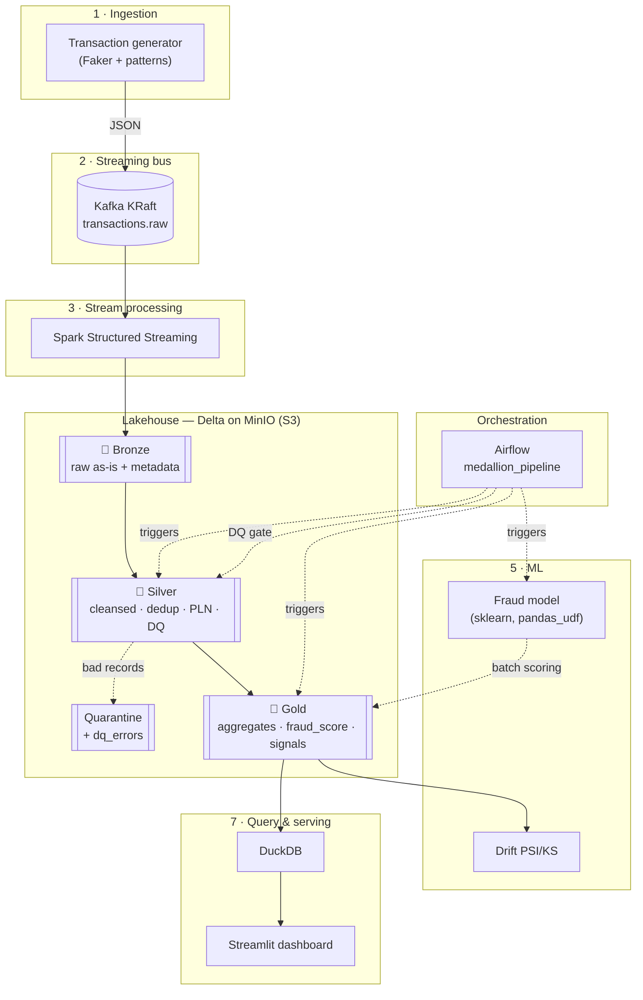

# TransactPulse — Architecture

A real-time Big Data **lakehouse** for (synthetic) financial transactions,
runnable end to end with a single `docker compose up`. This document explains the
system, each layer, and what it demonstrates.

> ⚠️ All data is synthetic — generated locally. No real banking data is used.

## End-to-end diagram

## Layers

### 1 · Ingestion (`ingestion/`)
A configurable synthetic transaction generator (Faker + custom logic): log-normal
amounts, ~0.3 % fraud skewed toward card-not-present channels / risky categories /
foreign country & device, hourly seasonality, and late-arriving events. A
confluent-kafka producer publishes JSON to `transactions.raw`, keyed by
`account_id`. Records are schema-validated before production.

### 2 · Streaming bus (`infra/`)
Apache **Kafka in KRaft mode** (no ZooKeeper) is the durable, replayable event
backbone. Dual listeners expose the topic to host (`localhost:9092`) and
containers (`kafka:9092`). Kafka UI provides inspection.

### 3 · Stream processing → 🥉 Bronze (`streaming/`)
**Spark Structured Streaming** consumes Kafka and appends to Delta
`bronze/transactions` **as-is** (raw `value` + parsed `data` struct + ingestion
metadata), partitioned by `ingestion_date`. Checkpointing + the Delta sink give
**exactly-once** ingestion (ADR 0004).

### 4 · 🥈 Silver — cleansing & data quality (`lakehouse/`)
Batch bronze → silver: type casting, currency normalization to PLN (FX table), ISO
upper-casing, dedup by `transaction_id` (latest wins), and a **data-quality gate**
(native Spark rules). Bad records are routed to a **quarantine** table with
`dq_errors`. Silver is an idempotent Delta **MERGE** (late-data tolerant) and is
**OPTIMIZE…ZORDER BY (account_id)**. Great Expectations reports off the critical
path (ADR 0005).

### 5 · 🥇 Gold + ML (`lakehouse/`, `lakehouse/ml/`)
Analytical tables — `daily_volume_by_country`, `merchant_category_kpi`,
`account_velocity`, `fraud_signals` — plus **`scored_transactions`** from a
scikit-learn model applied as a vectorized **`pandas_udf`** (model loaded once per
executor; heuristic fallback). **PSI/KS drift** of live scores/amounts vs the
training reference is reported (ADR 0006).

### 6 · Orchestration (`orchestration/`)
**Airflow** (`medallion_pipeline`, LocalExecutor) runs silver → DQ gate → gold
aggregates → scoring → drift as `DockerOperator` tasks on the jobs image. Tasks are
idempotent and restartable, with retries, an alert callback, and a blocking
data-quality gate (ADR 0007). A separate `train_fraud_model` DAG retrains weekly.

### 7 · Query & serving (`analytics/`, `dashboard/`)
**DuckDB** queries the gold Delta tables directly over MinIO (`httpfs` + `delta`),
with example analytics in `queries.sql` (ADR 0008). A **Streamlit** dashboard
surfaces KPIs, volume by country (map + bars), daily trend, fraud signals & ML
scores, and the data-quality / drift panels.

## Cross-cutting properties

- **Idempotency / reproducibility** — seeded generator, exactly-once bronze,
  MERGE-based silver, overwrite gold, deterministic scoring; re-runs converge.
- **Open formats, no lock-in** — Delta on S3-compatible MinIO; cloud-portable.
- **Data quality as a first-class gate** — bad data is quarantined, not silently
  dropped; promotion to gold is blocked on failing checks.
- **Containerized** — the whole stack runs with one `docker compose up`.
- **Tested & linted** — pure-Python logic is unit-tested; Spark transforms have
  Spark tests (run in CI); ruff + pytest + docker-build run in GitHub Actions.

## What this project demonstrates

For interviews and reviews, TransactPulse shows hands-on command of:

| Competency | Where |
| ---------- | ----- |
| **Real-time streaming** | Kafka (KRaft) + Spark Structured Streaming → bronze |
| **Lakehouse & medallion modeling** | Delta bronze/silver/gold on MinIO |
| **Exactly-once / idempotency** | checkpointing + Delta MERGE/overwrite |
| **Data quality engineering** | native gate + quarantine + Great Expectations |
| **Late / out-of-order data** | watermark horizon + late-event generation |
| **ML integration at scale** | `pandas_udf` batch scoring + heuristic fallback |
| **ML observability** | PSI/KS drift on gold |
| **Orchestration** | Airflow DAG with DQ gate, retries, alerting |
| **Analytics serving** | DuckDB over Delta + Streamlit dashboard |
| **Engineering hygiene** | ADRs, conventional commits, tests, CI, Docker |

See the [ADRs](adr/) for the reasoning behind each major decision.
