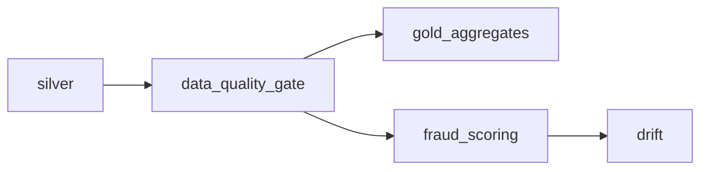

# Orchestration — Airflow `medallion_pipeline`

Apache Airflow (LocalExecutor on Postgres) schedules the batch path. Spark steps
run as **`DockerOperator`** tasks launching the `transactpulse/streaming` image on
the `transactpulse` network; the data-quality gate runs the same image with a
lightweight Python entrypoint. See [ADR 0007](../docs/adr/0007-airflow-vs-prefect.md).

## DAGs

| DAG                  | Schedule  | Purpose                                                  |
| -------------------- | --------- | ------------------------------------------------------- |
| `medallion_pipeline` | `@daily`  | silver → DQ gate → gold aggregates → scoring → drift     |
| `train_fraud_model`  | `@weekly` | (re)train the baseline model to the `tp-models` volume   |



Tasks are **idempotent** (Delta MERGE / overwrite) and **restartable** — any task
can be cleared and re-run. Each has `retries=2` and an on-failure alert callback.
The **data-quality gate** fails the run (blocking gold) if the silver quality
report has failing checks or the quarantine ratio is too high.

## Run

Prerequisites — infra up and the jobs image built:

```bash
docker compose -f infra/docker-compose.yml up -d --build
```

Start Airflow:

```bash
docker compose -f orchestration/docker-compose.yml up -d
# UI: http://localhost:8088   (admin / admin)
```

Trigger the pipeline from the UI, or:

```bash
docker compose -f orchestration/docker-compose.yml exec airflow-scheduler \
  airflow dags trigger medallion_pipeline
```

## How the tasks reach the data

- Spark tasks join the external `transactpulse` network, so they resolve
  `kafka:9092` / `minio:9000`.
- Reports (`/reports`) and the model artifact (`/app/models`) live on the shared
  named volumes `tp-reports` and `tp-models`, mounted into both the job containers
  and the scheduler.
- The Docker socket is mounted into Airflow so the `DockerOperator` can launch
  task containers (the scheduler runs as root for socket access — a local-demo
  trade-off, see ADR 0007).

## Notes

- `_PIP_ADDITIONAL_REQUIREMENTS` installs `apache-airflow-providers-docker` at
  container start (first boot is slower).
- The webserver is published on **8088** (8080 is taken by Kafka UI).
